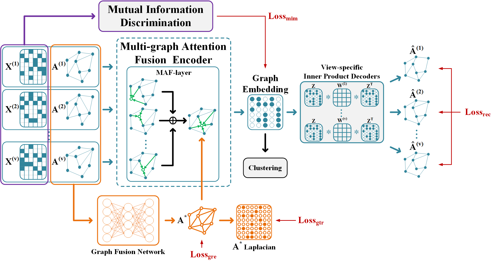

# Consistent Multiple Graph Embedding for Multi-View Clustering

This repo contains the demo code and data of our IEEE TMM'2021 paper Consistent Multiple Graph Embedding for Multi-View Clustering

>IEEE Xplore: [Consistent Multiple Graph Embedding for Multi-View Clustering](https://ieeexplore.ieee.org/abstract/document/9653859)
>

## Reference
If you find our work useful in your research, please consider citing:

```latex
@ARTICLE{9653859,
  author={Wang, Yiming and Chang, Dongxia and Fu, Zhiqiang and Zhao, Yao},
  journal={IEEE Transactions on Multimedia}, 
  title={Consistent Multiple Graph Embedding for Multi-View Clustering}, 
  year={2021},
  doi={10.1109/TMM.2021.3136098}}}
